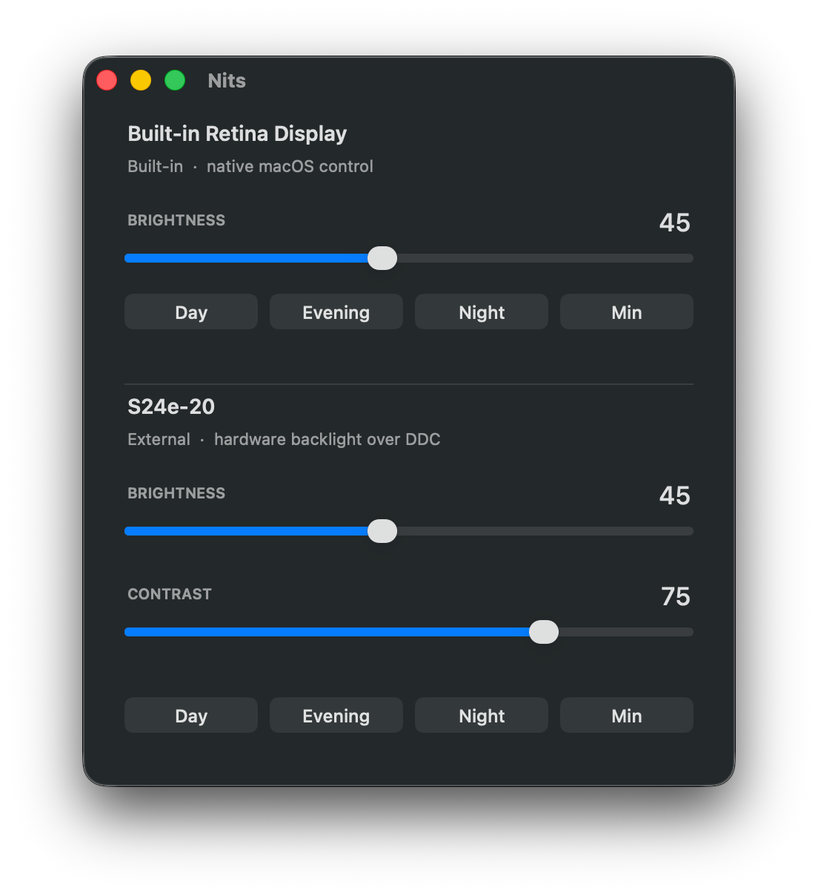

# Nits

A small macOS menu bar and window app for controlling display brightness and contrast,
including external monitors over DDC/CI.


## Screenshots

<p align="center">
  
</p>

<p align="center">
  
</p>

## Why

Most monitor control apps silently fall back to gamma dimming when the hardware path
fails. That darkens the pixels instead of the backlight, which raises black levels and
softens anti-aliased text. The failure is invisible: the slider moves, the screen dims,
and the picture quietly gets worse.

Nits has no software fallback. It drives the backlight or it reports an error.

## Features

- Brightness for every connected display, built-in and external
- Contrast for external displays
- Per-display presets (Day / Evening / Night / Minimum)
- Menu bar panel and a resizable window, both live
- Scroll over the menu bar icon or any slider to adjust
- Explicit errors when the control channel is missing or the monitor does not answer
- Remembers levels per display; adapts automatically when displays are connected or removed

## How it works

Two different mechanisms, depending on the display:

| Display  | Mechanism |
| -------- | --------- |
| Built-in | `DisplayServices`, the same private framework macOS uses for the brightness keys |
| External | `IOAVService` over IOKit, carrying DDC/CI packets on the DisplayPort AUX channel |

For external displays it writes standard VESA MCCS commands to I2C address `0x37`:
VCP `0x10` for luminance and `0x12` for contrast, with the usual XOR checksum.

### Matching displays to control channels

The IORegistry exposes framebuffers and AV services as separate trees with no direct
link. Both record the same connector token (`dispext0`, `dispext1`, …). Nits resolves
each display by matching its vendor, model and serial against `AppleCLCD2` entries,
reads the connector token from the registry path, then finds the `DCPAVServiceProxy`
filed under the same token. Each monitor therefore gets its own channel, which matters
once more than one external display is attached.

## Requirements

- Apple Silicon Mac, macOS 12 or later
- For external displays: a connection that carries DDC/CI

That last point is the common failure. Many USB-C to HDMI adapters pass video but drop
the control channel, because the DisplayPort-to-HDMI converter inside them does not
forward I2C-over-AUX. USB-C, Thunderbolt and DisplayPort connections are reliable;
HDMI through a cheap converter often is not. Adapters built on Synaptics VMM7100,
Parade PS176/PS186 or MegaChips MCDP2900 converters generally work.

## Build

```
make          # build into build/Nits.app
make install  # build, copy to /Applications, launch
make run      # build and launch in place
make clean
```

No Xcode project, no dependencies. One source file, clang, and frameworks already
present in macOS. The result is a ~120 KB executable.

## Notes

- Uses two private Apple frameworks, so it is not App Store material and could break
  in a future macOS release.
- DDC/CI reads are unreliable through some converters, returning garbage that passes
  no checksum. Nits therefore only writes, and never reads values back.
- Some monitors lock brightness and contrast when a fixed colour preset such as sRGB
  is selected, or when dynamic contrast is enabled. If the sliders do nothing, check
  those settings in the monitor's own menu first.

## Licence

[GNU Affero General Public License v3.0](LICENSE).

You may use, modify and redistribute this freely. If you distribute a modified
version, or run one as a network service, you must release your source under the
same licence.
